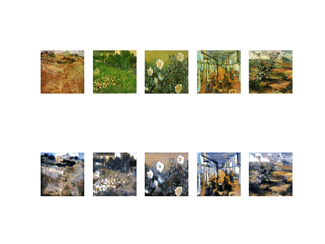

# imageGAN

Built a keras class CycleGAN model (Generative Adversarial Netowrk) to train models for different artists
(Vincent-Van-Gogh, Claude Monet).

Finally one can use app.py to deploy the models in FLASK.

From photo to Van-Gogh

From Van-Gogh to photo

## Usage
python app.py 

to deploy it on FLASK

# Image_GAN
heavily inspired from 
https://machinelearningmastery.com/cyclegan-tutorial-with-keras/